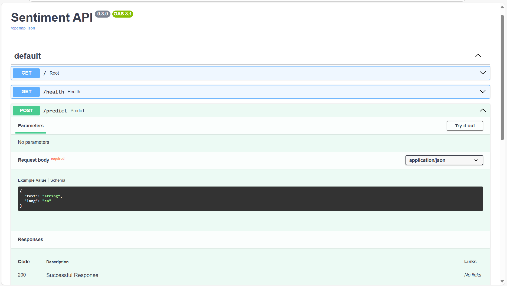
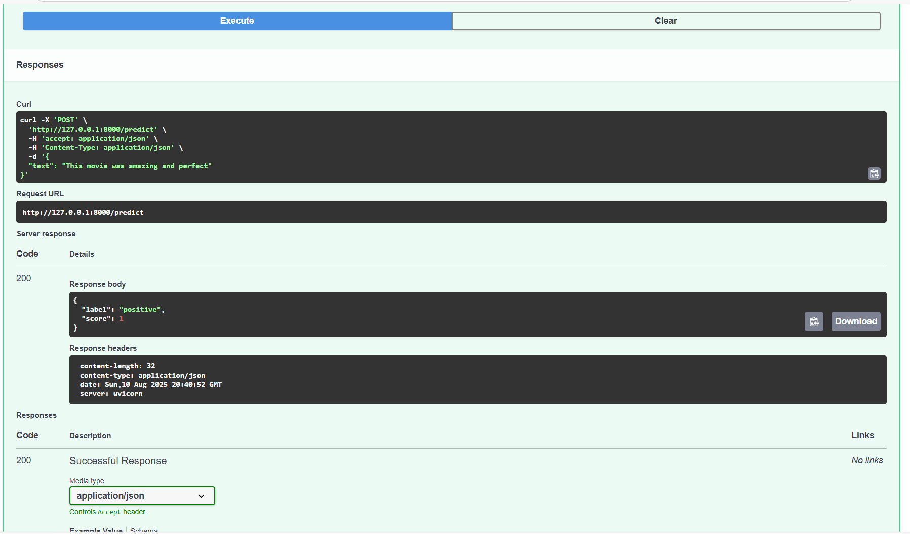
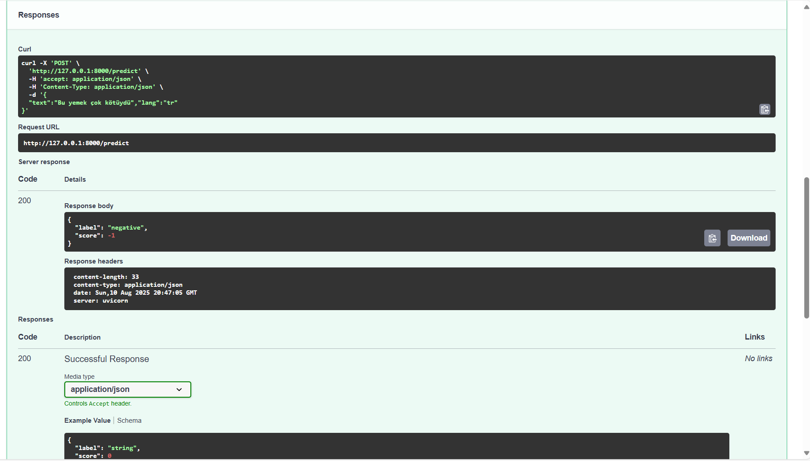
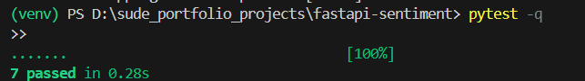

# FastAPI Sentiment Analysis API

A lightweight, extensible sentiment analysis API built with **FastAPI**.  
Supports **English** (default) and **Turkish**, with customizable lexicons, weighted sentiment scoring, negation handling, and intensifiers.

## Features
- **Multi-language** support (`en` default, `tr` available)
- **Weighted lexicon** for fine-tuned sentiment scoring
- **Negation handling** (e.g., `not good` → negative)
- **Intensifier scaling** (e.g., `very`, `extremely`)
- **Low-signal neutral detection**
- Easy to extend for other domains or sectors (via `PROFILE` env var)
- Interactive API docs with Swagger UI

---

## Quickstart

### Install dependencies
```bash
pip install -r requirements.txt
```

### Run the server
```bash
uvicorn app.main:app --reload --port 8000

```
Server will start at:

```bash
http://127.0.0.1:8000

```

Swagger UI: http://127.0.0.1:8000/docs

## API Usage
POST /predict
Predict sentiment for a given text.

Request body

```json

{
  "text": "This is very good",
  "lang": "en"
}
```
lang is optional. Defaults to "en". Supported: "en", "tr".

Response
```json
{
  "label": "positive",
  "score": 0.75
}
```

## Examples
English

```bash
curl -X POST http://127.0.0.1:8000/predict \
  -H "Content-Type: application/json" \
  -d '{"text":"This is very good"}'
```

```json
{"label": "positive", "score": 0.65}
```

Turkish
```bash
curl -X POST http://127.0.0.1:8000/predict \
  -H "Content-Type: application/json" \
  -d '{"text":"bu gerçekten mükemmel","lang":"tr"}'
```
```json
{"label": "positive", "score": 0.8}
```

## Project Structure
```bash
fastapi-sentiment/
│
├── app/
│   ├── main.py        # FastAPI app with sentiment logic
│   ├── lexicon.py     # Positive & negative word lists
│   └── __init__.py
├── tests/
│   └── test_api.py    # Pytest suite
├── requirements.txt
└── README.md

```

## Run Tests
```bash
pytest -q
```
If running from project root:

-Ensure app/__init__.py exists

-If needed, adjust sys.path in tests/conftest.py

## Advanced Usage
1. Custom word weights
Edit WORD_WEIGHTS_POS / WORD_WEIGHTS_NEG in main.py to change sentiment strength of specific words.

2. Sector-specific profiles (optional)
You can define domain-specific lexicons in lexicon.py:

```python
PROFILES = {
    "default": {...},
    "restaurant": {...}
}
```
Select with:

```bash
PROFILE=restaurant uvicorn app.main:app --reload
```

Note: Advanced usage – sector profiles (default, restaurant, etc.) supported.

## Example Output

<p align="center">
  <a href="images/swagger.png">
    
  </a>
  <a href="images/predict_en.png">
    
  </a>
  <a href="images/predict_tr.png">
    
  </a>
  <a href="images/tests.png">
    
  </a>
</p>
